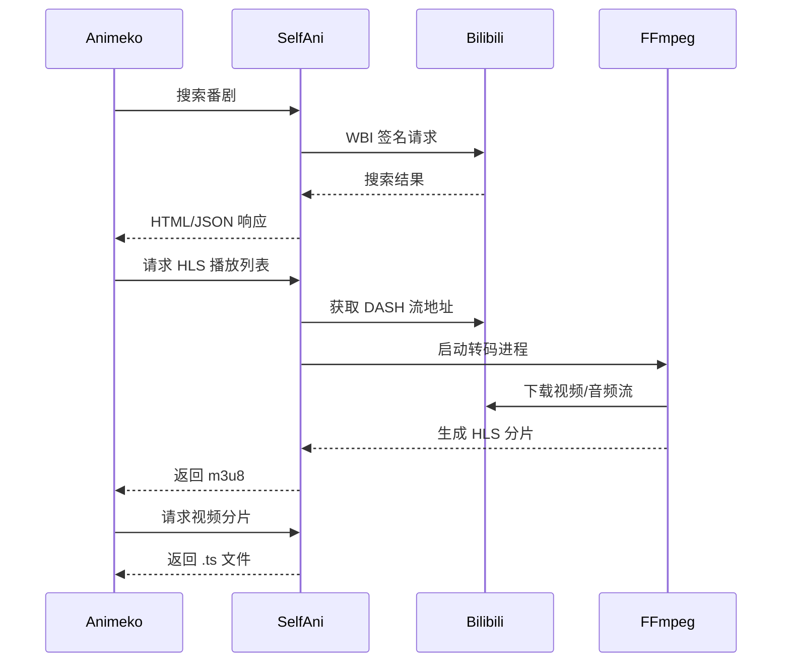

# SelfAni

**SelfAni** 是一个基于 Rust 的 HTTP 代理服务，将哔哩哔哩的动漫和视频内容转换为标准的 HLS（HTTP 实时流）格式。提供 [Animeko](https://github.com/open-ani/animeko) 规则。

---

> [!WARNING]
> 本项目仅供学习交流使用,禁止用于任何商业用途。所有接口与类型均来源于公开网络文档,项目仅对其整理与聚合。若有侵权请联系删除。
> 本项目不保证功能的准确性与可靠性,使用本项目所导致的一切后果与作者无关。
> 本项目随时可能因为接口变动、许可协议变更等原因导致无法使用或者停止维护。

## 核心功能

SelfAni 将 Bilibili 番剧转换为标准 HLS 流媒体，提供符合 Animeko 数据源规范的 API 接口。

### 主要特性

- **搜索接口**: 返回 JSON 或 HTML 格式的番剧搜索结果
- **详情接口**: 提供番剧元数据和剧集列表
- **HLS 流媒体**: 自动转码 DASH 为 HLS,支持 H.264/HEVC/AV1
- **自动登录**: 首次启动通过二维码登录获取凭据
- **WBI 签名**: 自动处理 B 站 API 签名验证

## 快速开始

### 环境要求

- **Rust 工具链** (2024 edition)
- **FFmpeg** (必须在系统 PATH 中,用于视频转码)

### 部署步骤

1. **克隆并编译**

```bash
git clone https://github.com/TNXG/selfani.git
cd selfani
cargo build --release
```

2. **首次运行 - 扫码登录**

```bash
./target/release/selfani
# 使用 B 站 App 扫描终端显示的二维码
```

3. **配置服务** (可选,编辑 `config.toml`)

```toml
[api]
bind = "0.0.0.0:8080"
public_base = "http://your-domain.com"  # 重要:填写实际访问地址
cache_dir = "cache"
```

4. **启动服务**
```bash
./target/release/selfani
```

## Animeko 集成配置

### 方式一: 使用内置配置文件

访问 `http://your-server:8080/` 获取 `provide.json`，直接导入 Animeko。

### 方式二: 手动配置

在 Animeko 中添加以下数据源配置:

```json
{
  "factoryId": "web-selector",
  "version": 2,
  "arguments": {
    "name": "SelfAni",
    "description": "自建 B 站番剧源",
    "iconUrl": "https://www.bilibili.com/favicon.ico",
    "searchConfig": {
      "searchUrl": "http://your-server/search?f=html&q={keyword}",
      "searchUseOnlyFirstWord": false,
      "searchRemoveSpecial": false,
      "rawBaseUrl": "http://your-server",
      "subjectFormatId": "json-path-indexed",
      "selectorSubjectFormatJsonPathIndexed": {
        "selectNames": "$.data[*].title",
        "selectLinks": "$.data[*].url"
      },
      "channelFormatId": "index-grouped",
      "selectorChannelFormatFlattened": {
        "selectChannelNames": ".channel-tabs a",
        "matchChannelName": "",
        "selectEpisodeLists": ".episode-panels > div",
        "selectEpisodesFromList": "a",
        "matchEpisodeSortFromName": "第\\s*(?<ep>.+)\\s*[集话]"
      },
      "matchVideo": {
        "enableNestedUrl": false,
        "matchVideoUrl": "^https?://.*\\.m3u8$"
      }
    }
  }
}
```

**重要**: 将 `your-server` 替换为实际部署地址,需与 `config.toml` 中的 `public_base` 一致。

## API 端点说明

| 端点                                   | 说明                    | 示例                            |
| -------------------------------------- | ----------------------- | ------------------------------- |
| `GET /search?q={keyword}&f=html`       | 搜索番剧,返回 HTML 格式 | `/search?q=葬送的芙莉莲&f=html` |
| `GET /search?q={keyword}`              | 搜索番剧,返回 JSON 格式 | `/search?q=葬送的芙莉莲`        |
| `GET /html/{season_id}`                | 获取剧集列表页面        | `/html/123456`                  |
| `GET /detail/{season_id}`              | 获取番剧详情 JSON       | `/detail/123456`                |
| `GET /hls/{season_id}/{ep}/index.m3u8` | HLS 播放列表            | `/hls/123456/1/index.m3u8`      |
| `GET /`                                | 获取 provide.json 配置  | `/`                             |

### 搜索响应格式

**HTML 模式** (`f=html`): 返回包含剧集链接的 HTML 页面,供 Animeko 解析

**JSON 模式**: 返回结构化数据

```json
{
  "code": 0,
  "success": true,
  "message": "",
  "data": [
    {
      "id": "123456",
      "title": "番剧标题",
      "cover": "封面 URL",
      "description": "简介",
      "year": "2024",
      "status": "完结",
      "type": "TV",
      "url": "http://your-server/html/123456"
    }
  ]
}
```

## 技术架构

### 核心流程



### 关键模块

- **`main.rs`**: HTTP 服务器和路由处理
- **`search.rs`**: B 站搜索 API 封装
- **`playurl.rs`**: DASH 流地址获取
- **`hls.rs`**: FFmpeg 转码和 HLS 生成
- **`wbi.rs`**: B 站 WBI 签名算法
- **`login.rs`**: 二维码登录流程
- **`cookies.rs`**: Cookie 持久化存储

### 视频转码策略

- **H.264 (codecid=7)**: 直接复制流,无需转码 (`-c:v copy`)
- **HEVC/AV1**: 转码为 H.264 以确保兼容性 (`-c:v libx264`)
- **音频**: 通常直接复制 (`-c:a copy`)

## 故障排查

### 常见问题

1. **登录失败 / -412 错误**

   - 删除 `cookies.jsonl` 重新扫码登录
   - 检查网络是否能访问 `api.bilibili.com`

2. **视频无法播放**

   - 确认 FFmpeg 已安装: `ffmpeg -version`
   - 检查 `cache/hls/` 目录权限
   - 查看日志中的 FFmpeg 错误信息

3. **Animeko 无法解析**
   - 确认 `public_base` 配置正确
   - 测试访问 `http://your-server:8080/search?q=test&f=html`
   - 检查返回的 HTML 是否包含正确的 HLS 链接

## 使用须知

### 信息安全

- 本项目**不收集**任何用户信息,包括用户名、密码、Cookie 等。
- 使用中的 `csrf_token` 和 `SESSDATA` 等 Cookie 字段均为用户登录后本地获取,**属于高度敏感信息**,请务必妥善保管。
- `SESSDATA` 的敏感程度等同于"密码 + 验证码",切勿泄露。

### 合法使用

- 本工具仅限用于技术学习与研究,**禁止用于违反哔哩哔哩用户协议的行为**。
- 作者不对使用本工具产生的任何封号、风控等后果负责。
- 严禁将获取的信息用于未授权的多平台转播等违规行为。

## 鸣谢

感谢以下开源项目及其作者对本项目的参考与借鉴:

- **BBDown**: 在下载流程、签名与分发策略方面提供了重要实现思路与参考。
- **BiliTools**: 在 API 调用、Cookie 管理与 HLS 处理等方面提供了宝贵的借鉴。
- **Copilot**: 在代码实现、项目设计与文档撰写方面提供了重要帮助。

本项目在实现过程中参考了上述项目的公开实现与文档,特此致谢。使用这些项目时请遵循它们各自的许可协议与服务条款。

## 许可证

本项目采用 AGPL 3 许可证。
